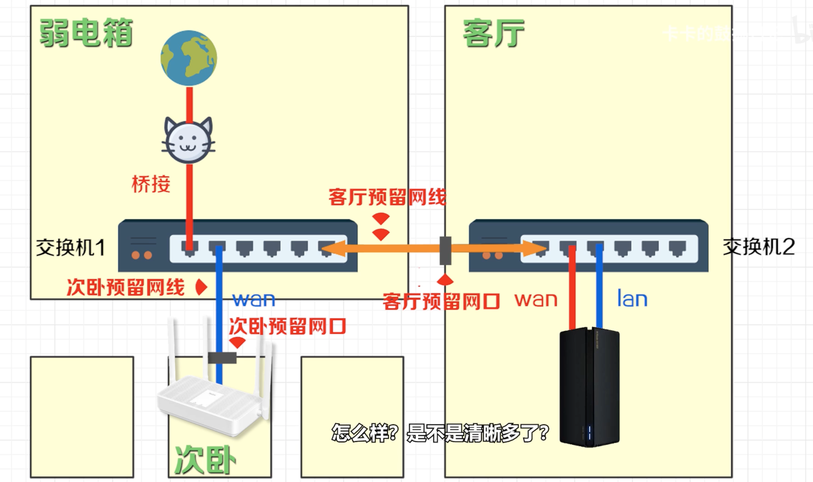

# 阅读记录

## 书籍

- [x] [天龙八部（新修版）](https://book.douban.com/subject/26322283/)：共5本，已完成4本。

  备注：天龙八部中很多情节太有bug，很多情节也是太生硬，比如乔峰的各种冤屈，为什么他爸爸要杀、并且总能先他一步杀掉相应的人。
  
  看完全集，竟然没有一丝激动，反而心里忧伤。心里最惦记的竟然是阿碧这个小姑娘，从小时候躲避仇人到姑苏慕容家，到结局仍然是陪着疯疯癫癫的慕容复，可惜！
  
  另外：新修版本里面有不少情节改动。例如最后的一章中说：慕容复疯癫以后，阿碧和王语嫣都陪在慕容复身边。而三联版本，只有阿碧一个人陪在慕容复身边。

- [ ] [Operating Systems: Three Easy Pieces](https://pages.cs.wisc.edu/~remzi/OSTEP/) - 操作系统学习

- [ ] [计算机网络课程 - Youtube](https://www.youtube.com/watch?v=XaGXPObx2Gs&list=PLowKtXNTBypH19whXTVoG3oKSuOcw_XeW)

- [x] [倚天屠龙记](https://book.douban.com/subject/1070851/)

- [x] [笑傲江湖](https://book.douban.com/subject/1002299/)

  本书结束时，盈盈伸手扣住令狐冲的手腕，叹道：想不到我任盈盈竟也终身和一直大马猴锁在一起，再也不分开了。盈盈的爱情得到了圆满，她是心满意足的，令狐冲的自由却又被锁住了。或许只有在仪琳的片面爱情之中，他的个性才极少受到拘束。

  1. 笑傲江湖连载时间：1967年4月20日至1969年10月12日。在此期间，中国国内正发生着一场政治运动（1966年5月16日至1976年10月6日）。所以在书中存在大量的文字是在讽刺当时的时代，从口号宣传（千秋万代，一统江湖）到对于权力的争夺（岳不群、左冷禅、任我行等等）。
  2. 从`令狐冲`这个主角来说。上一次看`《倚天屠龙记》`时，就觉得`张无忌`徘徊于多个女人之间，本书中的令狐冲同样游离于3位女子之间，在此之间的感情过于拖拉墨迹，不像是性格直爽的令狐冲的人物性格刻画。个人不喜如此金庸对于张无忌和令狐冲的这些修饰。希望能在重读`《鹿鼎记》`时，看到更为直爽、更贴切现实人物的心理描写。
  3. [MV - 笑红尘](https://www.bilibili.com/video/BV1xs411x7Nm?from=search&seid=8350225411898089717) - 诠释什么是潇洒江湖。

- [x] 17 | 为什么CPU结构也会影响Redis的性能？

## 文章学习

- [x] [read 文件一个字节实际会发生多大的磁盘IO？](https://mp.weixin.qq.com/s/vekemOfUHBjZSy3uXb49Rw)
- [x] [漫画 | 一台Linux服务器最多能支撑多少个TCP连接？](https://mp.weixin.qq.com/s/Lkyj42NtvqEj63DoCY5btQ)
- [x] [Standard Go Project Layout](https://github.com/golang-standards/project-layout/blob/master/README_zh.md) - 介绍Go工程的目录如何组织。但Russ Cox评价这个工程示例不是官方推荐的Go的标准。
- [x] [OpenTracing文档中文版（翻译）](https://wu-sheng.gitbooks.io/opentracing-io/content/)

## 代码学习

- [x] [ants](https://github.com/panjf2000/ants) - ants 是一个高性能且低损耗的 goroutine 池
- [ ] [gnet](https://github.com/panjf2000/gnet) - gnet 是一个高性能、轻量级、非阻塞的事件驱动 Go 网络框架
  zy：学习如何完成一个网络框架。
- [ ] https://github.com/juanfont/headscale
- [ ] Golang - runtime/map

## 备注

- [ ] [YouTube 上有哪些计算机方面的值得推荐的公开课？](https://www.zhihu.com/question/49071324) - 知乎上面的回答，如果需要学习的课程，可以到这上面找。
- [ ] [【中英文字幕】CS61C 2020（完结撒花❀）计算机组成原理 20200816](https://www.bilibili.com/video/BV1fC4y147iZ) - 计算机组成原理

## 学习OKR

### 《Go语言设计与实现》

| 章节                                                         | 完成时间  |
| ------------------------------------------------------------ | --------- |
| [4.1函数调用](https://draveness.me/golang/docs/part2-foundation/ch04-basic/golang-function-call/) | 2021-4-4  |
| [6.5 调度器](https://draveness.me/golang/docs/part3-runtime/ch06-concurrency/golang-goroutine/) | 2021-4-5  |
| [6.6 网络轮询器](https://draveness.me/golang/docs/part3-runtime/ch06-concurrency/golang-netpoller/) | 2021-4-7  |
| [6.1 上下文Context](https://draveness.me/golang/docs/part3-runtime/ch06-concurrency/golang-context/) | 2021-4-8  |
| [3.1 数组](https://draveness.me/golang/docs/part2-foundation/ch03-datastructure/golang-array/) | 2021-4-9  |
| [3.2 切片](https://draveness.me/golang/docs/part2-foundation/ch03-datastructure/golang-array-and-slice/) | 2021-4-9  |
| [3.3 哈希表](https://draveness.me/golang/docs/part2-foundation/ch03-datastructure/golang-hashmap/) | 2021-4-11 |
| [3.4 字符串](https://draveness.me/golang/docs/part2-foundation/ch03-datastructure/golang-string/) | 2021-4-11 |
| [5.1 for和range](https://draveness.me/golang/docs/part2-foundation/ch05-keyword/golang-for-range/) | 2021-4-20 |

- `interface{}`专题
  - [Russ Cox - Go Data Structures: Interfaces](https://research.swtch.com/interfaces)
  - [Go Interfaces](https://www.airs.com/blog/archives/277) - 反复阅读，需要输出自己的理解

- Go string vs []byte

  - [golang-string 和 bytes 之间的 unsafe 转换](https://jaycechant.info/2019/golang-unsafe-cast-between-string-and-bytes/)
  - [How to use unsafe get a byte slice from a string without memory copy](https://stackoverflow.com/questions/59209493/how-to-use-unsafe-get-a-byte-slice-from-a-string-without-memory-copy)
  - [How to efficiently concatenate strings in go](https://stackoverflow.com/questions/1760757/how-to-efficiently-concatenate-strings-in-go)
  - [zy] - `strings.Builder`的`Reset()`方法与`bytes.Buffer`的`Reset()`方法不同：
    - `strings.Builder`只是解除了跟底层数据的绑定关系。[源码](https://golang.org/src/strings/builder.go#L60)
    - `bytes.Buffer`是复用了底层数据。
    - 为什么`strings.Builder`不复用底层的数据呢。是因为：`strings.Builder`在做`string`转换的时候做了优化，具体参考：[Why doesn't string.Builder Reset() preserve the underlying buffer?](https://stackoverflow.com/questions/61515086/why-doesn-t-string-builder-reset-preserve-the-underlying-buffer)。它返回出去的字符串，仍然在复用底层的地址。相当于它的优化点在于`String()`函数。
    - 而`bytes.Buffer`的[String()](https://golang.org/src/bytes/buffer.go?s=2382:2414#L50)是复制一块内存，相当于做了一层内存拷贝。

## 日志

- 20210701
  - [Go语言中的单例模式](https://www.liwenzhou.com/posts/Go/singleton_in_go/)
    - 学习了`Check-Lock-Check`模式，也叫`Double Check`模式。`sync.Once`中就是使用了这种模式。

## 其他

### 网络相关

- MESH组网

  - [单线复用组网方式](https://www.bilibili.com/video/av754204424) - 教学如何组MESH：图解、视频、实例教学。

    

  - [MESH组网：单线复用+VLAN](https://www.bilibili.com/video/BV1SA411E75D) - 增加VLAN的支持，由此可以支持IPTV的接入。

  - [MESH组网方案全集（有线回程，无线回程，AP模式，单线复用）](https://zhuanlan.zhihu.com/p/352135931) - 知乎文章

  - [家庭网络设置](https://www.bilibili.com/video/BV1Bt4y1v7Lk)

    - 光猫切换成桥接模式。
    - 路由器放置到房间的正中间
    - 路由器周围没有明显的遮挡
    - 两台路由器组mesh
