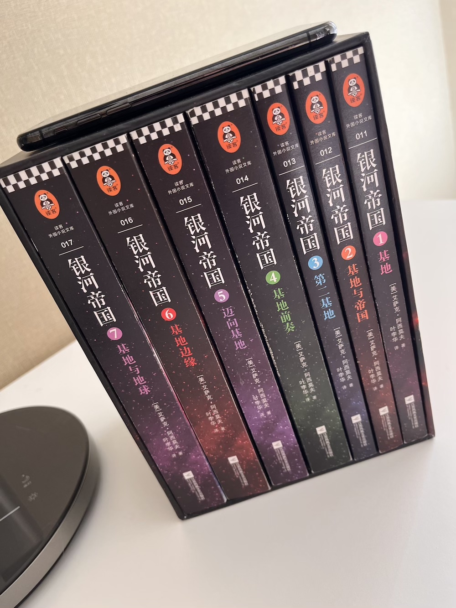
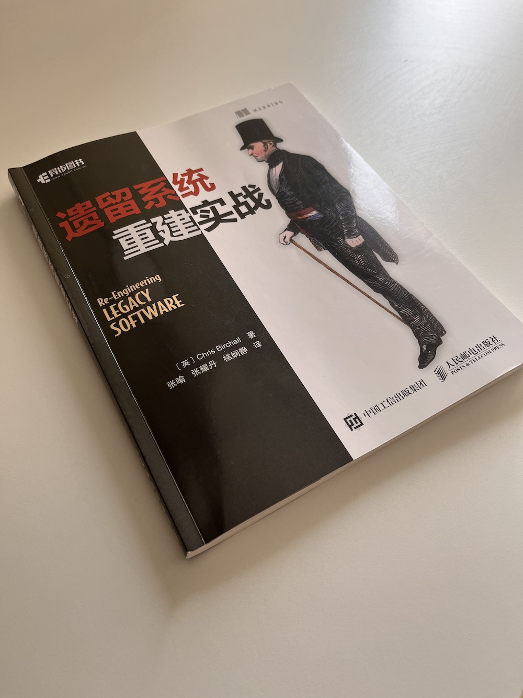

# Books

这里汇总记录我读书的进度。

 [*返回目录*](https://github.com/xpzouying/learning-notes#contents)

 

## <a id="contents">阅读列表</a>

-   <a href="#foundation">银河帝国：基地七部曲</a> - `100%`

-   <a href="#the-clean-coder">The Clean Coder: 程序员的职业素养</a> - `100%`

-   <a href="#clean-architecture">架构整洁之道</a> - `100%`

-   <a href="#clean-code">代码整洁之道</a> - `20%`

-   [连城诀](https://book.douban.com/subject/6969096/) - `100%`。过年假期闲来无聊，读一下没有读过的金庸小说。

-   <a href="#working-effectively-with-legacy-code">修改代码的艺术</a> - `10%`

-   <a href="#ztjgysx">中台架构与实现</a> - `40%`

-   <a href="#lyqdsj">领域驱动设计</a> - `100%`

-   <a href="#re-engineering">遗留系统重建实战</a> - `100%`

-   <a href="#designing-data-intensive-applications">数据密集型应用系统设计</a> - `70%`

-   [匠艺整洁之道：程序员的职业修养](#clean-craftsmanship) - `30%`

-   [每一天都是爱你的一天](#you-are-mom) - `100%`

 

## 阅读感受

### <a id="foundation">银河帝国：基地七部曲</a>

 

豆瓣： [银河帝国：基地七部曲](https://book.douban.com/subject/26389895/)

差不多是从 `2021 年 8 月 15 日 ` 读到 `2021 年 12 月底 `，完成了全套 7 本。

 [↑ top](#contents)

### <a id="the-clean-coder">程序员的职业素养</a>

 

-   豆瓣 - [程序员的职业素养](https://book.douban.com/subject/11614538/)

-   阅读时间 - 2022 年 2 月

-   完成状态 - 100%

Bob 大叔介绍一个程序员在平时的工作、开发过程中，需要怎么样的态度、原则。
非常适合刚刚踏入职场的新同学。相当于是程序员在工作和发展上的一些最佳实践的建议。

 [↑ top](#contents)

### <a id="clean-architecture">架构整洁之道</a>

-   豆瓣 - [架构整洁之道](https://book.douban.com/subject/30333919/)

-   阅读时间 - 2022 年 2 月 - 3 月

-   完成状态 - 100%

感觉整本书都在围绕讨论系统如何解耦合，战略上：模块、分层解耦合，战术上：大量使用依赖注入的方式。

由于最近也在负责对团队内部的代码结构进行规范重构，所以看了大量的相关资料，准备单独汇总成一篇文档介绍，
在这里先记下个 #TODO @xpzouying

 [↑ top](#contents)

### <a id="clean-code">代码整洁之道</a>

-   豆瓣 - [代码整洁之道](https://book.douban.com/subject/4199741/)

-   状态 - 2022 年 3 月 -

-   进度 - 进行中

这本书在 Bob 大叔关于《The Clean Code》系列的三本书中最早出版，却是我读的最晚的一本。

 [↑ top](#contents)

### <a id="working-effectively-with-legacy-code">修改代码的艺术</a>

-   豆瓣 - [修改代码的艺术](https://book.douban.com/subject/2248759/)

-   状态 - 2022 年 3 月 -

-   进度 - 进行中

这本书没有买到纸质书版本，只能看电子书版本了。

 [↑ top](#contents)

### <a id="ztjgysx">中台架构与实现</a>

-   豆瓣 - [中台架构与实现](https://book.douban.com/subject/35235992/)

-   状态 - 2022 年 3 月 -

-   进度 - 进行中

极客时间上面也有一门 [欧创新 - DDD 实战课](https://time.geekbang.org/column/intro/100037301) ，之前看过极客时间的课程，感觉太抽象了，当时没有看懂，再尝试买一本纸质书尝试一下。

 [↑ top](#contents)

### <a id="lyqdsj">领域驱动设计</a>

-   豆瓣 - [领域驱动设计](https://book.douban.com/subject/26819666/)

-   状态 - 2022 年 1 月

-   进度 - 100%

这是我看的第一本关于 DDD 的书，不知道是因为第一次接触 DDD 的 **复杂的**、 **抽象的** 概念，还是翻译的问题，基本上没有看懂！

后面等逐渐对 DDD 熟悉后，应该会重读一遍。

 [↑ top](#contents)

### <a id="re-engineering">遗留系统重建实战</a>

- 豆瓣 - [遗留系统重建实战](https://book.douban.com/subject/27150248/)

- 状态 - 2022 年 3 月 - 3 月

- 进度 - 100%

入职现在公司后，主导对现有遗留系统做大量的迁移、重构的工作。

原有后端系统全部由 Python 2.7 开发，需要将系统切换成 Go，这本书里面的不少建议还是非常有用的。比如我们在迁移成新的系统后，如果对新老数据进行同步处理，可以参考 `P120 创建新数据库`，这里非常有用，不过我们线上使用 binlog 同步的方式，将遗留系统的数据库数据同步到新的数据库中。

另外，这本书中的观点和 Bob大叔很多观点一致，比如：对 `单元测试` 的重视，自动化工具的重视。国外的工程师对于单元测试看起来都特别重视，而国内公司中，缺少这样的文化。可以从 [从 TikTok“重 QA 轻测试”来看中美软件开发之间的差异](https://www.infoq.cn/article/jm0g5zkl3osu8hugibna) 文章中也看得出来明显区别。

这里在补充一点单元测试对于遗留系统重构的个人观点。由于我们线上代码存在大量的事务性脚本代码形式，且没有单元测试，导致一旦一个代码上线后，基本上也很难进行重构。因为一旦修改一处地方，不确定会影响多少周边模块的结果，从而随着时间和需求的迭代，代码质量越来越差，由此也越来越难以重构、优化，由此代码的开发就掉进了一个恶性循环的过程中。

另外， `第 7 章 - 开发环境的自动化` 的一个示例也介绍了自动化的重要性，强烈推荐这一章。虽然其中的使用的技术可以使用 Docker 替代，但是原理上将自动化工具普及到团队、个人的工作中，还是非常有必要，来替代我们常见的手工操作。我也准备把家里运行在 `homelab` 上面的各种程序使用自动化脚本工具管理起来。

 [↑ top](#contents)

### <a id="designing-data-intensive-applications">数据密集型应用系统设计</a>

- 豆瓣 - [数据密集型应用系统设计](https://book.douban.com/subject/30329536/)

- 状态 - 2022 年 3 月 - 4 月

- 进度 - 一共 3 部分，阅读完毕 前 2 部分。

周边很多人都在推荐该书，确实是本好书。

粗读第一遍时，正在阅读 [nutsdb](https://github.com/nutsdb/nutsdb) 的源码，结合书中数据库相关的理论知识，收益颇多。

学会了如何去看一个数据库的设计，底层使用什么数据结构存储，如何实现一个事务，事务对应的隔离是如何实现的，等等。

在看该书之前，只知道大概的概念，但是看完本书后，知道如何从架构的角度上去拆解一个数据库了。

 [↑ top](#contents)

### <a id="clean-craftsmanship">匠艺整洁之道：程序员的职业修养</a>

- 豆瓣 - [匠艺整洁之道：程序员的职业修养](https://book.douban.com/subject/35879791/)

- 状态 - 2022 年 5 月 - 至今

Bob 大叔的一本 `Clean` 系列的封笔之作，依然是大力的在推广代码质量，如何做好编码的测试。

但是，从个人待过的大厂和小厂来说，还没有在国内的公司感受到公司领导层对于代码质量的重视，一切依然是业务至上。但是对于实际体验来说，正如书中的经验所讲，一旦没有单元测试，原有的业务代码会出现：代码僵化、可维护性差等等弊病，但是呢，`WHO CARES? NO ONE !!!`

另外，该书配套的有 Bob 大叔演示视频，可以在 [Oreilly](https://learning.oreilly.com/videos/clean-craftsmanship-disciplines/9780137676385/9780137676385-CCC1_clean_craftsmanship_stack/) 观看。

### <a id="you-are-mom">每一天都是爱你的一天</a>

- 豆瓣 - [每一天都是爱你的一天](https://book.douban.com/subject/35389470/)

- 状态 - 2022 年 6 月 19 日

- 进度 - 完成

这本书是一本介绍“妈妈”的书，推荐给每一位即将当妈妈或者已经是妈妈的人阅读，同时也推荐给“爸爸们”阅读，让每一个人都能知道“妈妈们”是多么不容易。