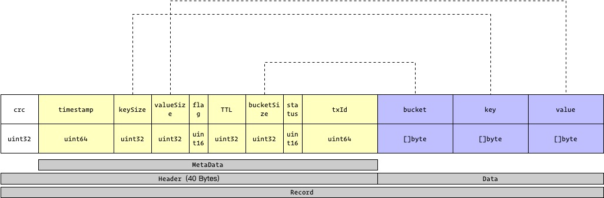

# NutsDB

代码使用 `tag=v0.1.0` 版本。

**db 两种方式**

- HintAndRAMIdxMode - 默认，Entry 整个都保存在内存中。
- HintAndMemoryMapIdxMode - 内存中就保存索引，真正的数据需要从数据文件中获取。


## <a id="contents"> Contents </a>

- [读写操作](#simple-put-get)


<br /> <hr />


## <a id="simple-put-get"> 读写操作 </a>

<details>

<summary> 代码示例 </summary>

```go
package main

import (
	"log"

	"github.com/xujiajun/nutsdb"
)

func main() {
	opt := nutsdb.DefaultOptions
	opt.Dir = "/tmp/nutsdb" // 这边数据库会自动创建这个目录文件
	db, err := nutsdb.Open(opt)
	if err != nil {
		log.Fatal(err)
	}
	defer db.Close()

	// to do
	if err := db.Update(func(tx *nutsdb.Tx) error {
		if err := tx.Put("bucket1", []byte("foo"), []byte("bar"), 0); err != nil {
			return err
		}
		return nil
	}); err != nil {
		panic(err)
	}

	if err := db.View(func(tx *nutsdb.Tx) error {
		entry, err := tx.Get("bucket1", []byte("foo"))
		if err != nil {
			return err
		}

		log.Printf("entry: %+v", entry)
		return nil
	}); err != nil {
		panic(err)
	}

}
```

</details>


`Update` 和 `View` 方法，是为了保障事务，暂时先跳过，先关注读写操作流程以及对应的流程。


<br /> <hr />

### <a id="entry-object">Entry 对象</a>

一个操作对象，在 NutsDB 中叫 Entry，其数据结构如下：



这里也分为 Header 和 Data 两块区域：

1. Header - 40 Bytes（固定长度）。从 crc 到 txId。
2. Data - bucket、key、value。


<br /> <hr />

### 底层实现 - 写

```go
func (tx *Tx) put(bucket string, key, value []byte, ttl uint32, flag uint16, timestamp uint64) error {
    // 删除无关代码

	tx.pendingWrites = append(tx.pendingWrites, &Entry{
		Key:   key,
		Value: value,
		Meta: &MetaData{
			keySize:    uint32(len(key)),
			valueSize:  uint32(len(value)),
			timestamp:  timestamp,
			Flag:       flag,
			TTL:        ttl,
			bucket:     []byte(bucket),
			bucketSize: uint32(len(bucket)),
			status:     UnCommitted,
			txId:       tx.id,
		},
	})

	return nil
}
```

1. `put` 方法是对该事务的 Entry 列表，增加一个 Entry 对象而已。再未完成提交之前，都还在内存中。

2. 在 `Tx.Commit` 时，才会真正的写盘。Commit 在 Update 方法中，在没有错误的情况下，会自动调用完成。
   事务的分析放到后面介绍。


<br /> <hr />

### 底层实现 - 读


**HintAndRAMIdxMode 模式**


默认使用的 db 模式是：`HintAndRAMIdxMode`。暂时删除其他无关代码。

```go
// Get retrieves the value for a key in the bucket.
// The returned value is only valid for the life of the transaction.
func (tx *Tx) Get(bucket string, key []byte) (e *Entry, err error) {

	// 先找到索引， idx 索引。
	if idx, ok := tx.db.HintIdx[bucket]; ok {

		r, err := idx.Find(key)
		if err != nil {
			return nil, err
		}

		if r.H.meta.Flag == DataDeleteFlag || r.isExpired() {
			return nil, ErrNotFoundKey
		}

		if idxMode == HintAndRAMIdxMode {
			return r.E, nil
		}
	}

	return nil, errors.New("not found bucket:" + bucket + ",key:" + string(key))
}
```

1. 通过 bucket 名字，从 `hash` 找到对应 bucket 的索引，索引使用 `B+` 树实现。

2. 然后通过索引找到对应的 Entry 。因为是使用 `HintAndRAMIdxMode` 模式，所以找到的 Record。其中 Record 包含对应的 Metadata 和 Entry，通过 Metadata 判断是否有效，若未有效，则返回里面的 Entry 即可。


**B+ 树的数据**

所有的数据都保存在 B+ 树的叶子结点中，叶子结点上面的元素叫做：`Record`，其中的结构为：

```go
// Record records entry and hint.
Record struct {
	H *Hint
	E *Entry
}
```

1. Hint - 数据元素的 MetaData 数据。包含，是否被删除、过期时间等等。
2. Entry - 真实的数据。


> TODO(zy): 在 Hint 和 Entry 中都包含 MetaData，不知道为什么需要相同的数据？


<br />

**HintAndMemoryMapIdxMode 模式**

如果开启 `HintAndMemoryMapIdxMode` 模式，则内存中只是包含索引，真实的数据都保存在文件中。

```go
// Get retrieves the value for a key in the bucket.
// The returned value is only valid for the life of the transaction.
func (tx *Tx) Get(bucket string, key []byte) (e *Entry, err error) {
	if idx, ok := tx.db.HintIdx[bucket]; ok {  // B+ 树找到对应的索引

		r, err := idx.Find(key)  // 
		// 省略部分代码

		if idxMode == HintAndMemoryMapIdxMode {
			path := tx.db.getDataPath(r.H.fileId)
			df, err := NewDataFile(path, tx.db.opt.SegmentSize)
			if err != nil {
				return nil, err
			}

			item, err := df.ReadAt(int(r.H.dataPos))
			if err != nil {
				return nil, fmt.Errorf("read err. pos %d, key %s, err %s", r.H.dataPos, string(key), err)
			}

			if err := df.m.Unmap(); err != nil {
				return nil, err
			}

			return item, nil
		}
	}

	return nil, errors.New("not found bucket:" + bucket + ",key:" + string(key))
}
```

先找到对应的 B+ 实现的索引，这一步与前面的一致。

由于内存中的 B+ 树，只包含对应的数据索引，真正的数据需要去文件中读取。所以这里会通过 Record 中的 Hint 数据获取对应 Entry 所在的文件和偏移位，读出真正的数据。


**如何从磁盘文件中加载数据**

1. 从 B+ 树索引获取文件和数据在文件中的偏移位（Offset），即可定位到 Entry 在文件的开始位置。
2. [Entry 结构体](#entry-object) 分为 Header 和 Data 两块。首先加载 Header （固定的 40 字节），然后根据 Header 中的数据 `bucketSize`、 `keySize`、`valueSize`，分别加载出对应的数据。

> TODO(zy): 在这里使用了 mmap 的文件映射，进行加速。需要研究一下 mmap 的使用。


<br /> <hr />

## <a id="refs"> Refs </a>

- [NutsDB 说明文档](https://github.com/nutsdb/nutsdb/blob/master/README-CN.md)


## todos

- [ ] 事务提交是如何实现的。
- [ ] TTL 是如何实现的。
- [ ] 写日志，是如何工作的。Append Log 或者 WAL。
- [ ] 具体研究一下 [隔离级别](https://github.com/nutsdb/nutsdb/blob/master/README-CN.md#%E9%9A%94%E7%A6%BB%E7%BA%A7%E5%88%AB%E4%BD%8E%E5%88%B0%E9%AB%98)
- [ ] B+ 树 vs LSM 树 的研究。