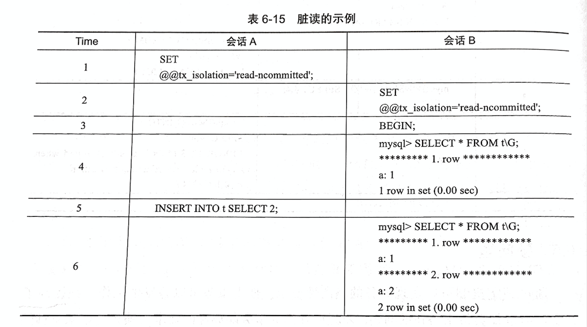
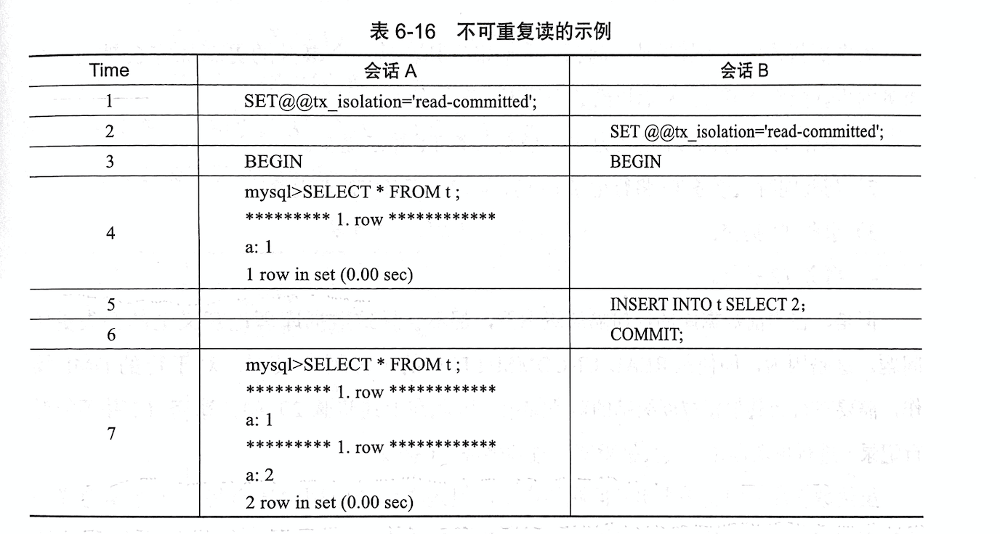

# MySQL学习笔记

## 前言

### MySQL环境说明

没有特别指定，存储引擎默认为InnoDB存储引擎。

-----

## 日志文件

日志文件分为：

- bin log：二进制日志

  **说明：**
  
    1. 记录**更改**的操作日志，不包括`SELECT`、`SHOW`之类操作。但是操作本身没有导致更改（0 rows affected），也可能会记录到binlog中。
    
    2. 默认情况，未开启，需要手动开启。
  
  **作用：**
  
    1. 恢复Recovery：数据的恢复；
    
    2. 赋值Replication：数据的复制到其他节点，进行实时同步
    
    3. 审计Audit：查询日志，判断是否产生注入攻击
  
- redo log：重做日志

## 锁

Innodb的锁可以是基于MVCC实现的，可以是行级锁。
MyISAM的锁是表级锁。

### 锁的类型和实现

**一致性非锁定读**

InnoDB存储引擎，通过MVCC的方式读取当前执行时间数据库中的行的数据。

MVCC（多版本并发控制）：一个记录可能有不止一个快照数据，一般称为行多版本技术。由此带来的并发控制，称为MVCC。

**一致性锁定读**

默认配置下，事务的隔离级别为`REPEATABLE READ`，InnoDB的SELECT操作使用一致性非锁定读。

但是，在某些情况下，用户需要显示的对数据库读取操作进行加锁以保证数据逻辑的一致性。

InnoDB对SELECT操作支持两种一致性的锁定读（locking read）操作：

1. SELECT ... FOR UPDATE

   对读取的行记录加一个X锁

2. SELECT ... LOCK IN SHARE MODE

   对读取的行记录加一个S锁

### 锁问题

锁提高了并发，但是会带来潜在的问题。

**数据库默认的隔离级别**

- InnoDB默认的隔离级别为：`READ REPEATABLE`
- Microsoft SQL Server / Oracle：`READ COMMITTED`

**脏读**

与“脏页”的概念不同。

1. “脏页”表示在缓存池中已经修改的页，但是还没有刷新到磁盘中，即缓存中的页和磁盘中的页的数据是不一致的。“脏页”是因为数据库实例的内存和磁盘的异步造成的。读取“脏页”并不会影响数据一致性，因为最终都会被刷新到磁盘中，达成最终一致性。

2. “脏数据”是事务对缓冲池中的行记录的修改，并没有被提交（commit）。“脏数据”是指未提交的数据，如果读到了另一个事务中未提交的数据，则违反了数据库的隔离性。

“脏读”现象在生产环境中并不常发生。其出现的条件需要将事务的隔离级别修改为：`READ UNCOMMITTED`。

**不可重复读**

不可重复读指的是：一个事务A内多次读取同一个数据集合。在这个事务A还没有结束时，另外一个事务B也访问了同一数据集合，并做了一些DML操作。事务A在在一个事务内读到的数据是不一样的情况。

与“脏读”的区别：

- 脏读读到的是未提交的数据
- 不可重复读读到的是已经提交的数据。（在上面的情况下，是破坏了事务A的数据库一致性的要求）

InnoDB存储引擎中，通过使用`Next-Key Lock算法`来避免不可重复读的问题。

**丢失更新**

一个事务的更新操作会被另一个事务的更新操作所覆盖，从而导致数据的不一致。

例如：

1. 事务T1将行记录r更新为v1，但是事务T1并未提交。
2. 与此同时，事务T2将行记录r更新为v2，事务T2未提交。
3. 事务T1提交。
4. 事务T2提交。

上述例子中，事务T2并不能对行记录r进行更新操作，会被阻塞，直到事务T1提交。

要避免丢失更新发生，需要让事务在这种情况下的操作变成串行化，而不是并行操作。增加排他X锁。

## 事务

事务可由一条或多条SQL语句组成。是访问并更新数据库中各种数据项的一个程序执行单元。

在事务的操作中，要么都做修改，要么都不做，这就是事务的目的，也是事务模型区别与文件系统的重要特性之一。

ACID特性：

- **A（Atomicity），原子性：** 指整个数据库事务是不可分割的工作单位。
- **C（Consistency），一致性：** 事务将数据库从一种状态转变为下一种一致的状态。在事务开始之前和事务结束以后，数据库的完整性约束没有被破坏。例如，在表中有个字段为唯一约束，即字段不能重复。如果一个事务对该字段进行了修改，在事务提交或回滚后，该字段就变得不唯一了，那么就破坏了事务一致性的要求。
- **I（Isolation），隔离型：** 要求每个读写事务的对象对其他事务能相互分离。
- **D（Durability），持久性：** 一旦事务提交，则结果是永久性的。即使发生宕机等事故，数据库也能将数据恢复。

### 事务的实现

事务的隔离性由“锁”来实现。

原子性、一致性、持久性，则通过数据库的`redo log`和`undo log`来完成。

**redo log**

称为：重做日志，用来保证事务的原子性和持久性。

恢复提交事务修改的**页操作**。

redo通常是物理日志，记录的是页的物理修改操作。

**undo log**

用来保证事务的一致性。

undo回滚行记录到某个特定版本。

undo是逻辑日志，根据每行记录进行记录。

redo log用来保证事务的持久性，undo log用来帮助事务回滚及MVCC的功能。

### binlog和redo log

**本质上的关系：**

1. 重做日志在InnoDB存储引擎层产生，而binlog在MySQL数据库的上层产生。binlog不仅针对InnoDB存储引擎，而是任何的存储引擎都会产生binlog。

2. 日志记录的内容形式不同。

   binlog是一种逻辑日志，记录的是对应的SQL语句。

   redo log是物理格式日志，记录的是每个页的修改。

3. 写入磁盘的时间点不同。

   binlog只有在事务完成后，进行一次写入。

   redo log在事务进行中不断地被写入。

## InnoDB事务隔离级别和锁的关系

参考：[Innodb中的事务隔离级别和锁的关系](https://tech.meituan.com/2014/08/20/innodb-lock.html)

| 隔离级别                     | 脏读（Dirty Read） | 不可重复读（NonRepeatable Read） | 幻读（Phantom Read） |
| :--------------------------- | :----------------- | :------------------------------- | :------------------- |
| 未提交读（Read uncommitted） | 可能               | 可能                             | 可能                 |
| 已提交读（Read committed）   | 不可能             | 可能                             | 可能                 |
| 可重复读（Repeatable read）  | 不可能             | 不可能                           | 可能                 |
| 可串行化（Serializable ）    | 不可能             | 不可能                           | 不可能               |

- 未提交读(Read Uncommitted)：允许脏读，也就是可能读取到其他会话中未提交事务修改的数据
- 提交读(Read Committed)：只能读取到已经提交的数据。Oracle等多数数据库默认都是该级别 (不重复读)
- 可重复读(Repeated Read)：可重复读。在同一个事务内的查询都是事务开始时刻一致的，InnoDB默认级别。在SQL标准中，该隔离级别消除了不可重复读，但是还存在幻象读
- 串行读(Serializable)：完全串行化的读，每次读都需要获得表级共享锁，读写相互都会阻塞

# 参考资料

- [Innodb中的事务隔离级别和锁的关系](https://tech.meituan.com/2014/08/20/innodb-lock.html) 

