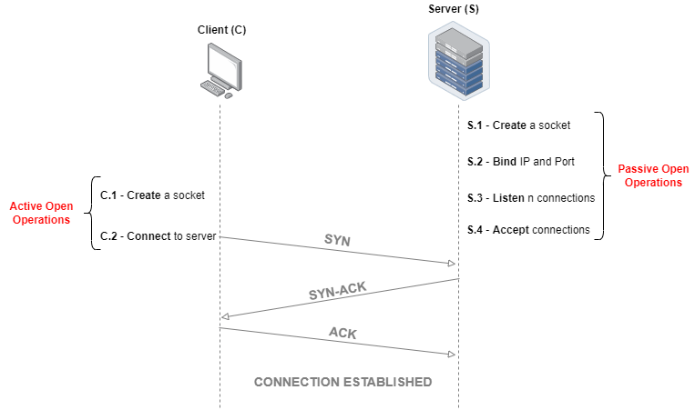
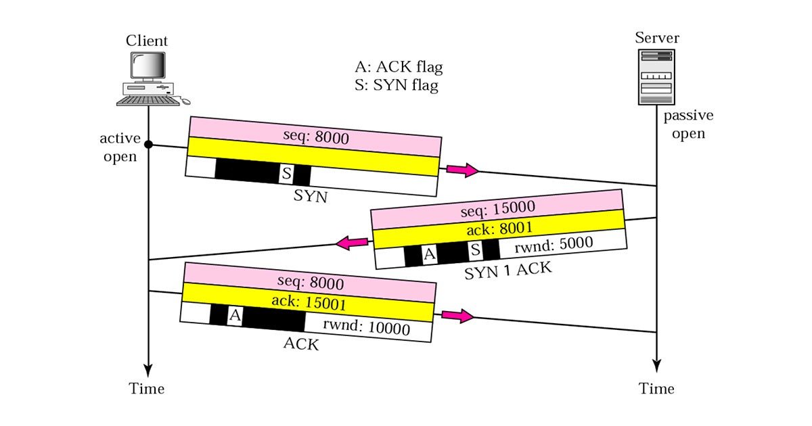
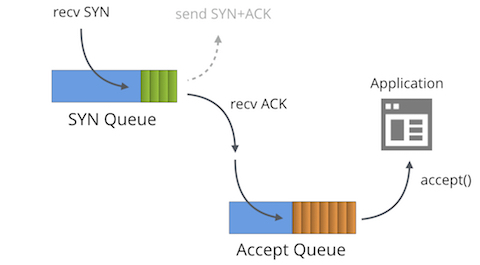
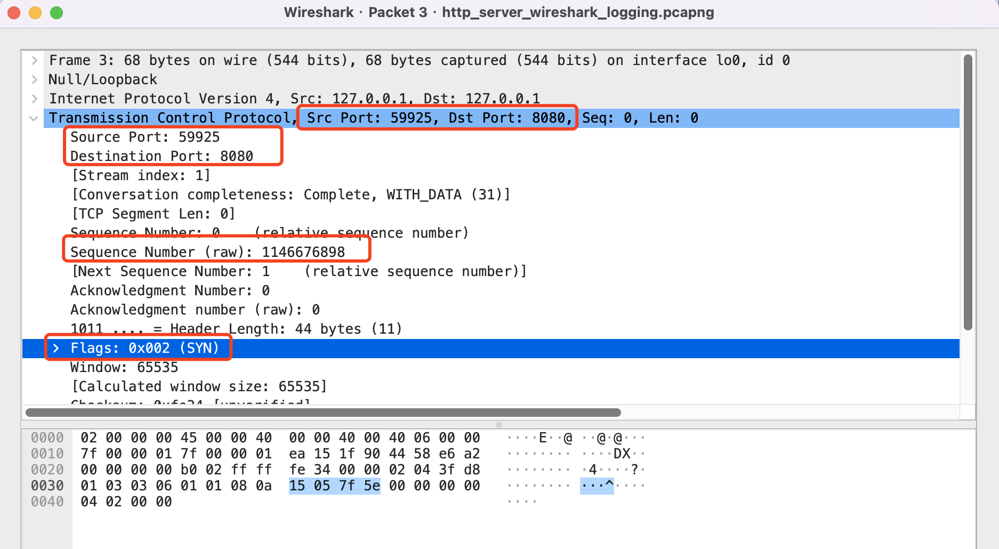
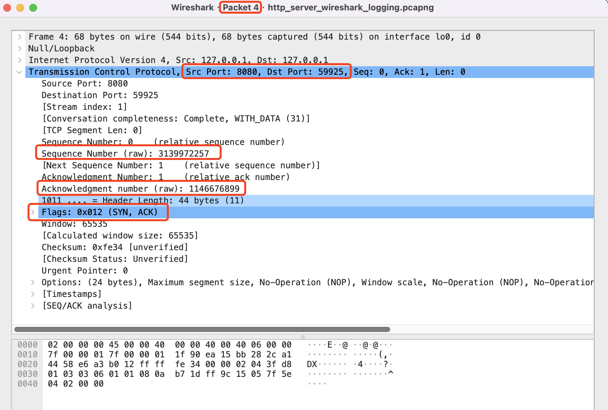
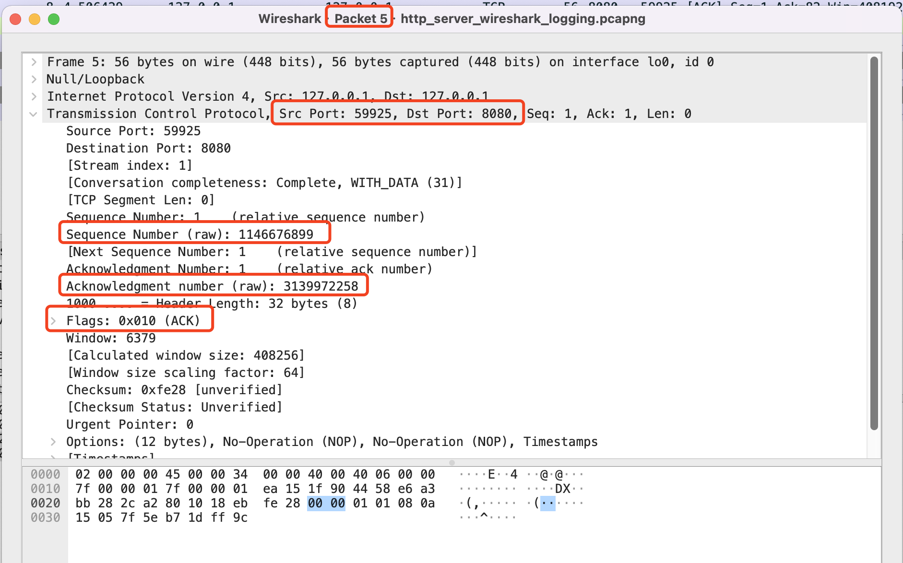

# TCP

这里汇总了 TCP 的知识点。

TCP 的全称是：`Transmission Control Protocol`，它是一种面向：` 连接的、可靠的、基于字节流的传输层协议 `。

它的作用就是完成 [传输层](https://zh.wikipedia.org/wiki/%E4%BC%A0%E8%BE%93%E5%B1%82) 指定的能力，与其能力类似的是面向无连接的 [UDP 用户数据报协议](https://zh.wikipedia.org/wiki/%E7%94%A8%E6%88%B7%E6%95%B0%E6%8D%AE%E6%8A%A5%E5%8D%8F%E8%AE%AE) 。

在 [互联网协议套件](https://zh.wikipedia.org/wiki/TCP/IP%E5%8D%8F%E8%AE%AE%E6%97%8F) 四层协议中，它位于 ` 应用层协议 ` 和 ` 网络层 ` 之间。

TCP 协议的运行可以划分为 3 个阶段，

- [连接创建](#tcp-connect)

- 数据传输

- 连接终止

这篇笔记将围绕上面 3 个阶段的过程进行展开。

<br />

 [*返回首页*](https://github.com/xpzouying/learning-notes#contents)

---

## [Contents](contents)

- [TCP 如何建立连接](#tcp-connect)

- TCP 如何进行传输

- TCP 协议详解

- [WireShark 抓包分析](#wireshark-tcp-connect)

---

## Notes

### <a id="tcp-connect">TCP 如何建立连接</a>

TCP 是基于 ` 连接 ` 的协议，那么首先看一下是如何创建连接的。

由于连接涉及到 server + client 双方：

- server 是被动一方，它的主要职责是：启动后，监听并等待请求，接收到请求后，对请求进行相应的处理。server 的这种行为叫做：`passive open`。

- client 是主动请求的一方，它的主要职责是：主动的发起连接。client 的这种行为叫做：`active open`。

**连接前的准备**

从上面可以看到在创建连接前，server 和 client 都需要做相应的准备，特别是 server 端。

server 为了能够处理 client 发过来的请求，那么需要提前准备：

1. 创建一个 `socket`。此时，只是存在一个文件描述符 ( sockfd ) 。

2. `bind` - 绑定一个 IP + Port 到前面创建的 socket 上。

3. `listen` - 设置 sockfd 为 `passive socket`，这样就可以处理进来的请求了。

4. `accept` - 接受请求。

client 为了建立请求，则会主动的向 server 发出连接请求 ( `SYN` 包 ) 。



<br />

**问题**

假设，在没有三次握手的情况，

server 已经启动，client 此时准备请求建立连接，那么就往 server 发送一个建立连接的 `SYN` 包 ( seq = 8000 ) ，server 端接收到 `SYN` 请求后立刻建立连接。如果一切正常，看起来都能正常工作。

但是网络总是不稳定，存在着延迟的问题。假设下列异常情况出现：

1. client --> server 发送 `SYN` 包 ( seq = 8000 ) 。但是该包在网络中产生了延迟，一直没有传送到 server 。

2. client 没有收到 server 的确认连接，那么进行重试，又发送了一个 `SYN` 包 ( seq = 8000 ) 。这次连接建立快，并且迅速处理完后，关闭了连接。

3. 当连接关闭后，第一步中的 `SYN` 包终于找到了 server, server 一看是个 `SYN` 包，那么赶紧建立好新连接 ( 因为我们假设没有三次握手的过程 ) ，然后等待 client 发送消息。这样就产生了错误的连接建立，也浪费了资源。

「三次握手」的目的就是：**为了防止已失效的连接 ( connect ) 请求报文传送到服务端，因而产生错误。也即为了解决「网络存在延迟的重复分组」的问题。**

<br />

**三次握手**



1. client 通过调用 `connect` 向 server 发起一个 `SYN` 包，请求一个主动打开。在该包类，包含一个 ` 随机数 ` 作为消息的序列号。如下图所示：*seq: 8000*。

2. server 接收到 `SYN` 包后，将该包放入 `SYN` 队列；并回送一个 `SYN/ACK` 包。其中里面标记 2 个重要数据：a ) 对于收到 `SYN` 包的 ACK， 即：ACK: 8001. b ) 请求创建连接的 `SYN` 包，也会随机生成一个消息序列号，如图中的 *seq: 15000*。

3. client 接收到 `SYN/ACK` 包后，发送一个 `ACK` 包，ACK 的确认码为 *ack:15001*，由此 `connect` 函数成功返回。

4. server 接收到这个 `ACK` 包后，在前面创建的请求帧从 `SYN` 队列中移除，放入到 `ACCEPT` 队列中。注意：此时的 `accept` 函数仍然是处于阻塞状态，但是可以被唤醒。因此，可以从 `ACCEPT` 队列中取出 `ACK` 包，重新创建一个新的用于双向通信的 `sockfd`，并返回成功。



上述的的过程就是三次握手的大概过程。

<br />

**异常错误的处理**

- server 接收到 client 发的 SYN 包后，会回 `SYN-ACK` 包。如果 client 没有成功的接收到 server 回复的 `SYN-ACK` 包，那么连接处于中间态，即没有成功，也没有失败。

此时，server 如果在一定时间内没有接收到 TCP 就会重发 SYN-ACK 包。Linux 默认情况下会重试 5 次。

<br />

**注意点**

- MTU 限制是哪一层协议的限制？

**参考资料**

- [wiki - 传输控制协议](https://zh.wikipedia.org/wiki/%E4%BC%A0%E8%BE%93%E6%8E%A7%E5%88%B6%E5%8D%8F%E8%AE%AE)

- [What are the difference between an active open and a passive open in a TCP socket?](https://stackoverflow.com/questions/29335144/what-are-the-difference-between-an-active-open-and-a-passive-open-in-a-tcp-socke)

- [Active vs. Passive Connection in TCP](https://www.baeldung.com/cs/tcp-active-vs-passive)

- [How TCP backlog works in Linux](https://veithen.io/2014/01/01/how-tcp-backlog-works-in-linux.html)

- [UDP 协议：UDP 和 TCP 相比快在哪里？](http://learn.lianglianglee.com/%E4%B8%93%E6%A0%8F/%E9%87%8D%E5%AD%A6%E6%93%8D%E4%BD%9C%E7%B3%BB%E7%BB%9F-%E5%AE%8C/34%20%20UDP%20%E5%8D%8F%E8%AE%AE%EF%BC%9AUDP%20%E5%92%8C%20TCP%20%E7%9B%B8%E6%AF%94%E5%BF%AB%E5%9C%A8%E5%93%AA%E9%87%8C%EF%BC%9F.md)

- [Cloudflare - SYN packet handling in the wild](https://blog.cloudflare.com/syn-packet-handling-in-the-wild/)

- [How TCP really works // Three-way handshake // TCP/IP Deep Dive](https://www.youtube.com/watch?v=rmFX1V49K8U)

<br />

 [↑ top](#contents)

<hr />

### <a id="wireshark-tcp-connect">WireShark 抓包分析</a>

使用 Go 建立 HTTP Server，然后再发起请求，分析 HTTP 的请求过程。

代码示例在 [demo1_http_server/main.go](../demo1_http_server/main.go)，运行：

```bash
# 运行 http server
go run main.go

# 发出请求
curl http://localhost:8080/bar
# Hello, "/bar"
```

由于 HTTP 是建立在 TCP 协议之上，所以从客户端发出 HTTP 请求后，首先需要使用[三次握手建立连接](tcp-connect)。


> WireShark 抓包日志在：[日志文件](./http_server_wireshark_logging.pcapng)，使用 WireShark 打开可以看到图中数据。

图中区域分别表示：

1. 红色区域是 TCP 建立三次握手的过程。

2. TCP 传输的过程。

3. TCP 四次挥手的过程。

**三次握手**

1. `No. 3` 报文分析
   
   1. 协议为 TCP
   
   2. `Info` 中表明了 端口是从 `59925 --> 8080` 端口，发送了一个 `SYN` 建立连接的报文。
   
   3. 双击这一行，可以点开更详细的信息，可以看到有个值 `Sequence Number (raw): 很大的一个数字`。这里是因为会随机一个大数，用于防止冲撞。
      
      

2. `No. 4` 报文分析
   
   1. `Info` 列中，表明这里是一个 `8080 --> 59925` 的一个响应。这个报文是 `[SYN, ACK]`，表示这里既是一个 SYN 报文，也同时是一个 ACK 报文。在三次握手的过程中，将这两个报文同时放在了一个报文中返回给客户端，表示：服务端确认客户端发过来的连接（ACK），同时也请求建立一次连接（SYN）。
      
      

3. `No. 5` 报文分析
   
   1. `Info` 列中，表明这里收到客户端发过来的 ACK 确认，确认收到服务端建立连接的过程。此时，客户端和服务器端双方就建立好了双向连接，从此就可以进行通信通信。
      
      

<br />

 [↑ top](#contents)

<hr />
